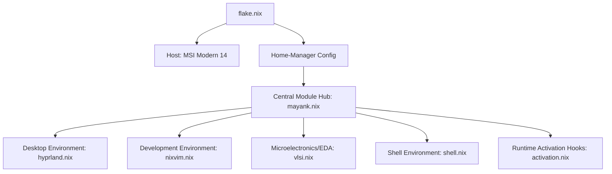

<div align="center">

# NixOS Engineering Workstation
## High-Assurance Hardware Design & Digital Verification Environment

[](https://nixos.org)
[](https://hyprland.org)
[](https://github.com/nix-community/nixvim)
[](LICENSE)

---

**A mathematically reproducible, modular NixOS workstation deployment optimized for state-of-the-art Very Large Scale Integration (VLSI) architectures, advanced functional digital verification (DV), and full-custom physical silicon design.**

[System Architecture](#-system-architecture) • [VLSI & Verification Stack](#-vlsi--verification-stack) • [FHS & Binary Compatibility](#-fhs-interoperability--binary-compatibility) • [IDE Architecture](#-integrated-development-environment) • [Workspace Controls](#-system-management)

---

</div>

## 🏗️ System Architecture

This workstation implements a declarative, modular Nix architecture using the **Master Hub** architectural pattern. System modules, user preferences, and developer libraries are decoupled into isolated functional boundaries to guarantee absolute reproducibility, transactional system rollbacks, and scalable maintenance.



---

## 🔬 VLSI & Verification Stack

The system provisions a comprehensive, pre-configured suite of academic and industry-grade Electronic Design Automation (EDA) utilities, supporting advanced Hardware Description Languages (HDLs), Hardware Verification Languages (HVLs), and formal proof systems.

### Core Toolchain Matrix

| Design & Verification Domain | Technical Utilities | Supported Standards & Methodologies |
| :--- | :--- | :--- |
| **Universal Verification** | `surelog` | **UVM (Universal Verification Methodology)**, SystemVerilog (IEEE 1800) |
| **Logic Simulation** | `verilator`, `iverilog`, `nvc`, `ghdl` | SystemVerilog (highly-optimized C++ compilation), Verilog (IEEE 1364), VHDL (IEEE 1076) |
| **Formal Analysis** | `sby` (SymbiYosys), `yosys` | Bounded Model Checking (BMC), Temporal Logic Assertions, Formal RTL Equivalence |
| **Waveform Visualization** | `surfer`, `gtkwave` | High-throughput FST, VCD, and GHW hardware execution trace analysis |
| **Physical Implementation** | `magic-vlsi`, `klayout` | Custom GDSII / OASIS layout editing, DRC (Design Rule Checking) |
| **Schematic & LVS** | `xschem`, `netgen` | Hierarchical SPICE/Verilog netlisting, Layout-Versus-Schematic validation |
| **Analog Simulation** | `ngspice` | SPICE engine mixed-level & mixed-signal simulation |
| **Code Diagnostic & LSP** | `svls`, `svlint`, `verible` | SystemVerilog Language Server Protocol, strict standard-compliance linters |
| **Hardware Modeling** | `systemc`, `veryl` | Transaction-Level Modeling (TLM 2.0), Modern logic-design dialect |
| **Documentation & Timing** | `python3Packages.wavedrom` | Declarative JSON-to-SVG timing diagram rendering |

---

## 🛡️ FHS Interoperability & Binary Compatibility

To bridge the gap between NixOS’s isolated store topology and legacy commercial microelectronics CAD tools, the workstation implements a dual-layer runtime compatibility suite:

```
  Legacy Executable / .sh Script
                │
                ├──► [Envfs FUSE Layer] ────────► Resolves /bin/bash & shebang paths dynamically
                │
                └──► [Nix-LD Dynamic Shim] ─────► Injects NIX_LD_LIBRARY_PATH (glibc, X11, GTK3)
```

1. **Envfs FUSE Virtualization (`services.envfs.enable = true`):**
   * Dynamically mounts a virtual directory overlay across `/bin` and `/usr/bin`.
   * Automatically resolves hardcoded legacy absolute shebang paths (e.g. `#!/bin/bash`, `#!/usr/bin/env sh`, `#!/usr/bin/python`) to the current active Nix store derivations without patching the source scripts.
2. **Nix-LD Dynamic Library Injection (`programs.nix-ld`):**
   * Configures a global system-wide loader shim (`/lib64/ld-linux-x86-64.so.2`) to run unpatched commercial Linux ELF executables.
   * Auto-populates `NIX_LD_LIBRARY_PATH` with crucial runtime libraries (including `glibc`, `zlib`, X11 desktop subsystems, graphics renderers, sound drivers, and core font utilities) to resolve dynamic linker dependencies transparently at execution time.

---

## 📟 Integrated Development Environment

Hardware description coding is powered by a custom-tailored **Nixvim** subsystem, yielding a responsive, IDE-like IDE specialized for silicon development.

*   **Semantic LSP Analysis**: Automated real-time code parsing, autocompletion, and diagnostic feedback via `Verible` (SystemVerilog), `VHDL-LS`, and `Clangd` (SystemC/C++).
*   **Structural Outline Navigation**: Tree-based navigation of complex nested RTL and UVM structures through `Aerial.nvim`.
*   **Syntax Standardization**: Automated formatter formatting rules mapped through the unified `Conform` framework (supporting `verible-verilog-format`).
*   **Media Previews**: Native vector graphics and schematic document rendering directly inside the editing workspace.

---

## 🎨 System Ergonomics

*   **Visual Compositor**: Minimalist, high-performance tiling compositor managed through Hyprland.
*   **Theme Orchestration**: Automatic synchronization of system-wide aesthetic variables, active terminal configurations (Ghostty, Kitty), and user color scripts via a unified assets backend.
*   **Hardened Security**: Protected login environments with automated user keyrings, SSH authentication managers, and encrypted credential paths.

---

## ⚡ System Management

Operational and deployment routines are orchestrated through a unified custom CLI control harness:

| Command | Operational Rationale |
| :--- | :--- |
| `mayank rebuild` | Standardizes Nix syntax, commits active revisions to Git, executes transactional NixOS compile, and updates remote backups. |
| `mayank update` | Evaluates system lockfiles, updates flake inputs, and pulls current external source packages. |
| `mayank clean` | Triggers recursive garbage collection and system optimization to recover storage structures. |

---

<div align="center">
  <sub>Developed & Maintained by <b>Mayank Anand</b></sub>
</div>
