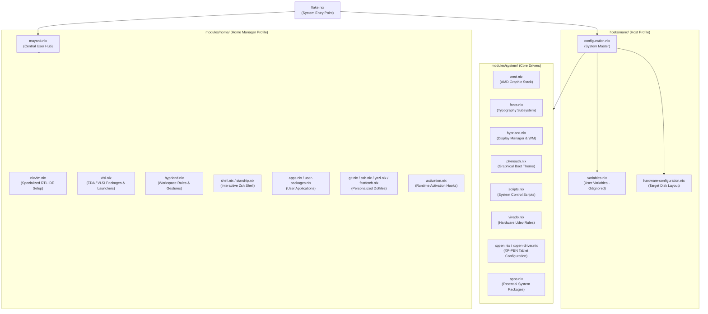

<div align="center">

# 🌌 High-Performance Engineering Workstation
### Declarative Microelectronics & Functional Hardware Verification Environment

[](https://nixos.org)
[](https://github.com/CachyOS)
[](https://hyprland.org)
[](https://github.com/nix-community/nixvim)
[](LICENSE)

---

**A mathematically reproducible, modular NixOS workstation deployment configured for advanced digital design, functional verification (DV), custom silicon physical layouts, and streamlined interactive computing. Crafted specifically for hardware engineering enthusiasts, VLSI career professionals, and passionately curious digital logic designers.**

[Host Identity & Optimizations](#-host-identity--optimizations) • [System Architecture](#-system-architecture) • [VLSI & Verification Stack](#-vlsi--verification-stack) • [Branding & Aesthetics](#-branding--immersive-aesthetics) • [Binary Compatibility](#-fhs-interoperability--binary-compatibility) • [IDE Architecture](#-integrated-development-environment) • [Workspace Controls](#-system-management) • [Credits](#-acknowledgments--credits)

---

</div>

## 💻 Host Identity & Optimizations (`MANX`)

At the core of this workstation is the custom host configuration **`MANX`**. Tailored specifically for modern AMD architecture and highly intensive silicon modeling workloads, it bridges extreme system responsiveness with strict declarative stability.

### Key Workstation Capabilities:
*   **CachyOS Kernel Optimization:** Runs the highly optimized **CachyOS Linux Kernel** (`linuxPackages-cachyos-latest-x86_64-v3`) utilizing `-v3` microarchitecture instructions, yielding improved memory throughput and execution speeds.
*   **Next-Gen Task Scheduling:** Leverages the **sched-ext** user-space scheduling framework with the `scx_lavd` (Latency-Aware Virtual Desktop) scheduler, providing unmatched interactive smoothness even under heavy multi-threaded VLSI compilations.
*   **Fluid Boot Sequence:** Employs the **Limine Bootloader** styled with a bespoke translucent deep ruby glassmorphic menu card, glowing electric red borders, neon green standard terminals, and a custom **Plymouth boot animation** powered by early-graphical SimpleDRM handover.
*   **System Integrity & Resiliency:** Automated monthly **Btrfs filesystem scrubbing** to prevent bit-rot, rapid `zram` compressed swap allocation for dynamic memory expansion, and CPU performance governing configured via `power-profiles-daemon`.
*   **Security & Hardening:** Robust underlying LUKS encryption, secure automated Gnome Keyring hooks, pre-integrated VPN configurations (OpenConnect, OpenFortiVPN, WireGuard), and graphic writing tablet integrations via specialized XP-PEN kernel drivers.

---

## 🏗️ System Architecture

This repository adopts a strictly decoupled, modular configuration layout. By isolating system-wide resources, user preferences, and hardware properties, the workstation guarantees absolute reproducibility and clean maintenance boundaries.



---

## 🔬 VLSI & Verification Stack

This workstation provisions a production-grade, pre-configured collection of academic and industry-standard Electronic Design Automation (EDA) applications. The packages are organized to support advanced Hardware Description Languages (HDLs), Hardware Verification Languages (HVLs), and formal proof frameworks.

### Core Toolchain Matrix

| Design & Verification Domain | Tech Utilities | Supported Standards & Methodologies |
| :--- | :--- | :--- |
| **Universal Verification** | `surelog` | **UVM (Universal Verification Methodology)**, SystemVerilog (IEEE 1800) |
| **Logic Simulation** | `verilator`, `iverilog`, `nvc`, `ghdl` | Highly-optimized C++ RTL compilation, Verilog (IEEE 1364), VHDL (IEEE 1076) |
| **Formal Analysis** | `sby` (SymbiYosys), `yosys` | Bounded Model Checking (BMC), Temporal Logic Assertions, RTL Equivalence |
| **Waveform Visualization** | `surfer`, `gtkwave` | High-throughput FST, VCD, and GHW hardware execution trace analysis |
| **Physical Implementation** | `magic-vlsi`, `klayout` | Custom GDSII / OASIS layout design, DRC (Design Rule Checking) |
| **Schematic & Netlisting** | `xschem`, `netlistsvg` | Hierarchical SPICE/Verilog capture, vector schematic generation |
| **Analog Simulation** | `ngspice` | SPICE engine mixed-level & mixed-signal simulation |
| **Code Diagnostic & LSP** | `svls`, `svlint`, `verible` | SystemVerilog Language Server Protocol, strict standard-compliance linters |
| **Hardware Modeling** | `veryl` | Modern logic-design dialect transpiling directly to SystemVerilog |
| **Documentation & Timing** | `python3Packages.wavedrom` | Declarative JSON-to-SVG digital timing diagram rendering |

> [!NOTE]
> **A Passionately Curious Approach to Hardware Engineering:**
> This configuration represents a personal, evolving journey into the deep and fascinating world of silicon design. Driven by genuine curiosity and a passion for microelectronics, this ecosystem is actively maintained and expanded. As my knowledge in functional verification, advanced architectures, and physical design continues to grow, I am committed to exploring and configuring new EDA tools, synthesis frameworks, and design methodologies to keep this system at the absolute cutting edge.

### Integrated AMD Xilinx Vivado & Vitis Environment

To support hardware syntheses and target FPGA development, the configuration implements isolated desktop launchers running the **AMD Vivado & Vitis 2025.2 Design Suite** inside an optimized **Distrobox container** (`mayank-vivado`). This setup keeps the root Nix store completely pristine while giving the applications full acceleration and access to system devices:

*   **AMD Vivado (GUI & Terminal):** Standard standalone graphical launch and integrated Tcl shell environments running inside Ghostty, Kitty, or xterm.
*   **AMD Vitis Unified IDE:** Integrated software platforms for heterogeneous system designs (GUI & CLI environments).
*   **Support Utilities:** Interactive Documentation Navigator (`DocNav`), Xilinx Information Center (`XIC`), and safe integrated uninstall mechanisms.

### 🚀 Expanding Your VLSI Toolkit (Future Explorations)

This workstation is designed to grow alongside your journey in silicon engineering. As you explore new microelectronics concepts, physical design workflows, or advanced digital logic architectures, you can seamlessly append new Electronic Design Automation (EDA) utilities to your environment.

To integrate additional tools into your declarative stack:
1.  **Search the Nixpkgs Index:** Find the package attribute name for the utility you want by searching [search.nixos.org](https://search.nixos.org).
2.  **Open the VLSI Profile:** Load your user-space engineering configuration file:
    ```bash
    nvim ~/nix-config/modules/home/vlsi.nix
    ```
3.  **Append the Package:** Locate the `home.packages = with pkgs; [` block and add the new tool attribute cleanly within the list:
    ```nix
    home.packages = with pkgs; [
      # --- VLSI TOOLS (DV & PD focus) ---
      surelog
      verilator
      your-new-eda-utility # Append your discovered tools here
    ];
    ```
4.  **Synchronize and Deploy:** Compile the new environment transaction immediately using your developer system wrapper:
    ```bash
    mayank rebuild
    ```

---

## 󰪢 Branding & Immersive Aesthetics

This workstation implements a **Production-grade** immersive environment inspired by the latest **Omarchy 3.8** standards. It transforms the display into a mission-critical "Silicon Security" dashboard that balances visual sophistication with functional system monitoring.

### The "Silicon Workstation" Screensaver

Powered by a GPU-accelerated Alacritty engine and **TerminalTextEffects (TTE)**, this screensaver is engineered for maximum visual fidelity and system harmony.

*   **High-Fidelity Adaptive Scaling:** Automatically detects native screen resolution to scale artwork dynamically. This ensures branding is perfectly **Centered** and optimized for any display size.
*   **Real-time Aesthetic Synchronization:** The screensaver environment is permanently coupled with the global **Ambxst theme**. It dynamically updates terminal color palettes and typography (**JetBrains Mono, Size 16**) in real-time without session interruption.
*   **Comprehensive Animation Suite:** Includes 37+ specialized TTE effects (e.g., *Matrix, Blackhole, VHS Tape*) cycling through a robust, self-healing orchestration loop.
*   **Integrated Performance Analytics:** A live telemetry dashboard embedded in the ASCII art provides real-time monitoring of **CPU Load** and **RAM Utilization**.
*   **Seamless Architectural Integration:** 
    *   **Atomic Handover:** Orchestrated to yield instantly to the **Ambxst Lock Screen**, ensuring a clean, flicker-free transition between art and security.
    *   **Workflow Preservation:** Intelligently inhibits execution during active user input, media playback, or high-intensity VLSI simulations.
    *   **Manual Override:** Full compatibility with the Ambxst "Caffeine" master switch for total environmental control.

### 🎨 Management CLI: `mayank screensaver`

A streamlined interface for managing workstation aesthetics without manual configuration overhead.

| Command | Operational Workflow |
| :--- | :--- |
| `mayank screensaver ascii` | Initializes a live editor for custom ASCII art. Applies updates with immediate, centered previews. |
| `mayank screensaver image <path>` | Transcodes any image (PNG/JPG) into high-resolution terminal symbols with an automated visual preview. |
| `mayank screensaver reset` | Restores the default **MANX Silicon Workstation** branding and system telemetry dashboard. |

---

## 🛡️ FHS Interoperability & Binary Compatibility

To bridge the gap between NixOS’s isolated store topology and legacy commercial microelectronics CAD tools, the workstation implements a seamless dual-layer compatibility layer:

```
  Unpatched Commercial Binary / Legacy Shell Script
                        │
                        ├──► [Envfs FUSE Layer] ────────► Resolves /bin/bash & shebang paths dynamically
                        │
                        └──► [Nix-LD Dynamic Shim] ─────► Injects NIX_LD_LIBRARY_PATH (glibc, X11, GTK3)
```

1.  **Envfs shebang Virtualization (`services.envfs.enable = true`):** Dynamically intercepts and virtualizes hardcoded directory paths in scripts (such as `#!/bin/bash`, `#!/usr/bin/env python`, or `#!/bin/sh`), pointing them transparently to correct active Nix store paths without requiring manual patching.
2.  **Nix-LD Dynamic Library Injection (`programs.nix-ld`):** Intercepts standard Linux ELF dynamic linkers, injecting a custom loader path populated with critical graphics, system, font, and desktop libraries (including `glibc`, `zlib`, X11, OpenGL, GTK3, and ALSA). This allows proprietary binaries to execute exactly as they would on traditional FHS-compliant systems.

---

## 📟 Integrated Development Environment

Hardware development is anchored by a highly customized, responsive **Nixvim** configurations. The editor is optimized specifically for writing error-free hardware descriptions and system verifications.

*   **Real-time Semantic Analysis:** Language server protocols configured for `Verible` (SystemVerilog), `VHDL-LS` (VHDL), and `Clangd` (SystemC/C++).
*   **Structural Outlines:** In-depth tree-based code exploration using `Aerial.nvim` to track hierarchical RTL and UVM structures.
*   **Unified Formatting:** Standardized coding styling applied automatically on save via the `Conform` framework (utilizing `verible-verilog-format`).
*   **Interactive Utilities:** File explorers managed through `yazi`, rapid terminal toggles, and customized aesthetic extensions.
---

## 🚀 Deployment & Installation

This workstation configuration is fully reproducible. To deploy this environment on a target system cleanly without compilation errors, follow these sequential steps:

### 1. Clone the Configuration
Clone the repository directly into the home directory of the target machine:
```bash
git clone https://github.com/techanand8/nix-config.git ~/nix-config
```

### 2. Configure Gitignored Variables (Mandatory)
To protect personal developer details (such as keys, primary emails, and specific home boundaries), this system decouples variables into a gitignored `variables.nix` file. This file **must** be created before triggering a rebuild, or the compilation will error due to a missing source.

Initialize your local variables file using the provided configuration template:
```bash
cp ~/nix-config/hosts/manx/variables.nix.example ~/nix-config/hosts/manx/variables.nix
```
Open the newly created `variables.nix` in your text editor and adjust the attributes:
*   `username` / `fullName` / `email`: Configure your standard system credentials.
*   `timezone` / `locale`: Set your localized region settings.
*   `cpuType` / `gpuType`: Set according to your graphic and processor stack (e.g., `amd`).

### 3. Generate Target Hardware Configuration
Extract your local disk mapping and core device drives into the host directory:
```bash
nixos-generate-config --show-hardware-config > ~/nix-config/hosts/manx/hardware-configuration.nix
```

### 4. Execute the System Rebuild
Apply the configuration cleanly using the specialized system utility:
```bash
sudo nixos-rebuild switch --flake .#MANX
```
*Note: From this point forward, you should use the professional `mayank rebuild` command for all system adjustments.*

---

## ⚙️ Workstation Customization

This configuration is designed for clean user adjustments and kernel configurations:

### 1. Customizing the Hostname
To assign a unique network identity to your workstation:
1. Open `hosts/manx/variables.nix` and set the `hostname` string to your preference (e.g., `hostname = "custom-node";`).
2. Open `flake.nix` at line 44 and update the system output handle from `nixosConfigurations.MANX` to match your target hostname (e.g., `nixosConfigurations.custom-node`).
3. Deploy the build using the customized flake handle:
   ```bash
   sudo nixos-rebuild switch --flake ~/nix-config#custom-node
   ```

### 2. Tailoring Kernel Selections
You can select different kernel configurations inside `hosts/manx/configuration.nix` at line 74:
*   **CachyOS Latest (Default):** Runs the highly responsive, performance-optimized kernel compiled with modern `x86_64-v3` architecture instructions:
    ```nix
    boot.kernelPackages = pkgs.cachyosKernels.linuxPackages-cachyos-latest-x86_64-v3;
    ```
*   **CachyOS LTS:** Switches to the Long-Term Support kernel branch, maintaining optimized execution loops with enhanced regression stability:
    ```nix
    boot.kernelPackages = pkgs.cachyosKernels.linuxPackages-cachyos-lts-x86_64-v3;
    ```
*   **NixOS Standard Vanilla Kernel:** Falls back cleanly to upstream standard packages, bypassing CachyOS optimizations if needed:
    ```nix
    boot.kernelPackages = pkgs.linuxPackages_latest;
    ```

> [!NOTE]
> **Performance Architecture & LTO (Link-Time Optimization) Rationale:**
> Link-Time Optimization (LTO) enables the compiler to generate slightly tighter binaries. However, building a custom Linux kernel locally with LTO from source takes several hours, places intense thermal stress on the hardware, and exhausts extensive memory structures.
> 
> Furthermore, custom source-compiled kernels with extreme LTO flags frequently introduce severe compilation, signing, or runtime conflicts with out-of-tree proprietary kernel modules—most notably **VMware Workstation virtual machine monitors** and specific custom device drivers.
> 
> **Why VMware Workstation is the Primary Integrated Hypervisor (Over KVM/QEMU):**
> In the professional microelectronics and EDA industry, high-end commercial CAD suites (such as Cadence Virtuoso/Spectre, Synopsys Design Compiler, or Mentor Graphics) utilize highly complex, proprietary node-locked or hardware-dongle license-daemon bindings.
> 
> For educational exploration, independent research, and sandboxed validation of these specialized tools, pre-configured legacy system appliances and license environments are **strictly optimized and verified solely for VMware hypervisor virtualization layers**. Attempting to run these commercial workloads inside vanilla KVM/QEMU, VirtualBox, or other open-source hypervisors routinely corrupts licensing daemon loopbacks, breaks virtualized GPU hardware-acceleration mappings, or causes major kernel panics inside the guest image.
> 
> To maintain a clean, safe, and rapid deployment pipeline, this setup **avoids compiling custom source code kernels with LTO locally**. Instead, it pulls pre-compiled, highly responsive **CachyOS kernel binaries** (optimized natively with `-v3` microarchitecture instructions) directly from verified community cache substituters. This delivers **99% of the scheduling responsiveness and execution gains of an LTO-optimized kernel** instantly, ensuring full out-of-the-box compatibility with VMware Workstation virtualization suites and hardware JTAG device hooks without compile overhead or update delays.

---

## ⚡ System Management

Rebuilding, updating, and optimizing the system is driven by a custom developer CLI utility. This utility leverages modern Nix helpers (**NH**, **NOM**, and **NVD**) to provide a high-fidelity, professional orchestration experience.

| Command | Engineering Pipeline & Rationale |
| :--- | :--- |
| `mayank rebuild` | Executes a complete system transaction: Validates syntax via **NOM**, enforces **RFC-166** formatting, stages changes to Git, applies configuration via **NH**, and generates a visual package delta report using **NVD**. |
| `mayank update` | Synchronizes all flake inputs to their absolute latest versions and performs an atomic full-system rebuild. |
| `mayank clean` | Initiates a **Three-Layer Deep Maintenance** protocol: Intelligent generation pruning, full store garbage collection, and hardware-level hard-link optimization (`nix-store --optimise`). |
| `mayank check` | Performs a comprehensive syntactical health and integrity audit of the entire flake configuration using **nix-output-monitor**. |
| `nix fmt` | Automatically formats all Nix configuration files in the repository using the official community RFC-166 standard. |

---

## 💖 Credits & Community Inspiration

This workstation configuration stands on the shoulders of giants. The modular architecture, performance profiling, and visual elegance of this ecosystem have been profoundly inspired by outstanding open-source projects. Sincere gratitude and respect are extended to:

*   **[ambxst](https://github.com/ambxst) (Axenide/Ambxst):** For establishing the phenomenal modular NixOS architecture and Home-Manager directory blueprints. This configuration adopts their structural philosophy as its foundational system design, enabling seamless declarative scaling.
*   **[illogical-impulse](https://github.com/end4) (end4/hyprland):** For crafting the breathtaking visual aesthetics, dynamic window rules, micro-animations, and fluid touchpad gestural physics. Their work sets the absolute gold standard for modern desktop usability and has heavily guided the design of this Hyprland environment.
*   **[Omarchy](https://github.com/omarchy) (Omarchy Linux):** For inspiring the jaw-dropping, GPU-accelerated fullscreen terminal screensaver workflow. Their creative implementation of dynamic Terminal Text Effects during system idleness sets a new benchmark for system customizability and hacker aesthetics.

*Thank you to these upstream creators and the broader open-source community for fostering a culture of limitless collaborative learning!*

---

<div align="center">
  <sub>Designed & Maintained by **Mayank Anand** • Driven by Passionate Curiosity • Configured Declaratively</sub>
</div>
