<div align="center">


<br/>


<br/>

[](https://nixos.org)
[](https://github.com/CachyOS)
[](https://btrfs.readthedocs.io)
[](https://hyprland.org)
[](https://github.com/nix-community/nixvim)

</div>

---

## Technical Overview

**MANX OS** is a highly optimized, reproducible, and declaratively managed operating system environment customized specifically for digital design, verification, and hardware description engineering. Rather than treating electronic design automation (EDA) tools as isolated, ad-hoc binaries, MANX OS models the entire hardware development suite as a first-class, version-controlled module in a Nix Flake structure.

### Key Architectural Pillars
* **Silicon-Grade Reproducibility**: Complete system closures are pinned and version-controlled via `flake.lock`. You can deploy the exact same workspace across a primary workstation and a portable engineering laptop with identical behavior.
* **Isolated EDA Execution**: Proprietary heavy toolchains (such as AMD Vivado and Vitis) run in an isolated high-performance container (Distrobox) utilizing native host Wayland window pass-through and direct JTAG `udev` hardware mapping.
* **Optional Statelessness (Impermanence)**: Models the root directory (`/`) as a temporary ramdisk wiped on every boot, mapping persistent configurations, private certificates, ssh keys, and the `/home` directories directly to a `/persist` Btrfs subvolume.
* **Consolidated Control Plane**: A custom management utility, `manx`, exposes a unified, color-coded interactive command suite for rebuilds, system package diffing, garbage collection, and binary cache pushing.

```mermaid
graph TD
    A[🔄 System Reboot] --> B[⚙️ Initrd Stage Rollback Scripts]
    B --> C[💾 Mount Physical Btrfs Root subvolid=5]
    C --> D[🧹 Delete Previous /root Subvolume]
    D --> E[❄️ Clone Fresh /blank Snapshot to /root]
    E --> F[🔒 Bind Mount Persistent Paths /persist]
    style A fill:#0d1117,stroke:#ff1133,stroke-width:2px;
    style B fill:#0d1117,stroke:#ff5555,stroke-width:2px;
    style C fill:#0d1117,stroke:#39ff14,stroke-width:2px;
    style D fill:#0d1117,stroke:#39ff14,stroke-width:2px;
    style E fill:#0d1117,stroke:#00f5ff,stroke-width:2px;
    style F fill:#0d1117,stroke:#7c3aed,stroke-width:2px;
```

## Authentication Interface (VLSI Workstation Console)

The display manager (SDDM) is configured as a VLSI CAD workstation terminal interface, integrating logic gate schematics, timing telemetry, and Verilog-style system warnings.

<div align="center">
<table style="border-collapse: collapse; border: none; width: 100%;">
  <tr>
    <td width="50%" style="padding: 10px; border: none; background-color: #0d0104; border-radius: 8px;">
      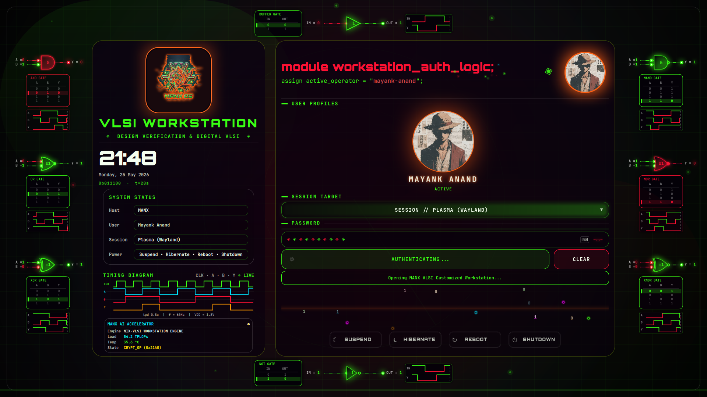
      <br/>
      <sub style="color: #39ff14;"><b>Logic Signal Synchronization</b> — Oscillating waveforms and interactive gates (AND, NAND, XOR) synced with signal flow.</sub>
    </td>
    <td width="50%" style="padding: 10px; border: none; background-color: #0d0104; border-radius: 8px;">
      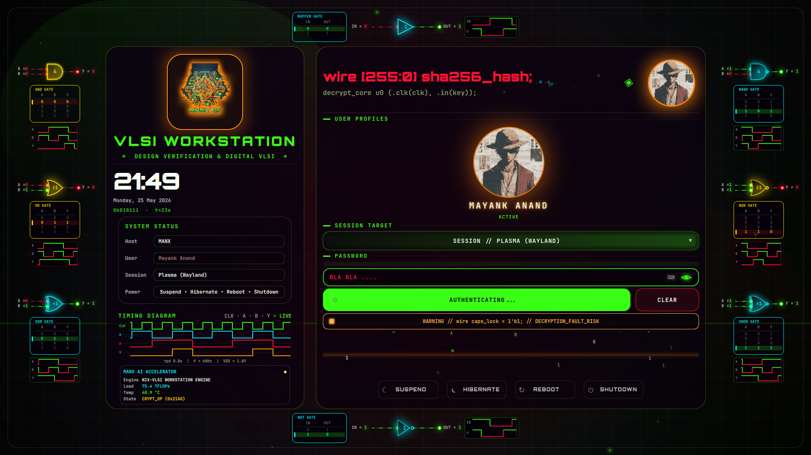
      <br/>
      <sub style="color: #ff1133;"><b>Active Cryptographic State</b> — Interface dynamically shifts from 'Idle Green' to 'Active Blue/Gold' during authentication.</sub>
    </td>
  </tr>
  <tr>
    <td width="50%" style="padding: 10px; border: none; background-color: #0d0104; border-radius: 8px;">
      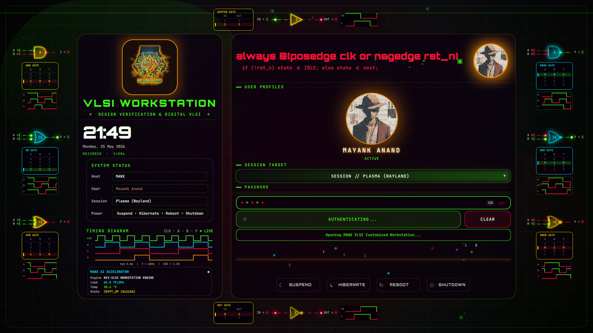
      <br/>
      <sub style="color: #00F5FF;"><b>Final Handshake</b> — The system validates logic timing before handing over to the Hyprland desktop session.</sub>
    </td>
    <td width="50%" style="padding: 10px; border: none; background-color: #0d0104; border-radius: 8px;">
      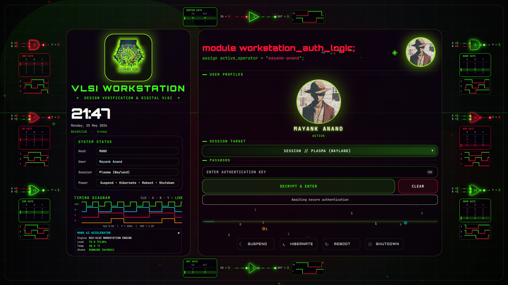
      <br/>
      <sub style="color: #FFD700;"><b>Workstation Console View</b> — A terminal-inspired interface with Verilog-style system state and real-time design telemetry.</sub>
    </td>
  </tr>
</table>
</div>
<br/>

<div align="center" style="border: 1px solid #4d0012; border-radius: 6px; padding: 12px; background-color: #060002;">

<video src="https://github.com/user-attachments/assets/aa285987-9626-49d8-abf5-803986e02768" width="100%" style="border-radius: 4px; box-shadow: 0 0 15px rgba(255, 17, 51, 0.2);" controls autoplay muted loop />

<sub><b>Full Silicon Simulation Walkthrough</b> — Demonstrates the zero-lag neon particle engine, sliding virtual keyboard, and synchronized timing diagrams.</sub>

</div>

<br/>

<div align="center" style="border: 1px solid #39ff14; border-radius: 6px; padding: 12px; background-color: #010602;">

<video src="https://github.com/user-attachments/assets/8d7dd3b6-e967-4537-b5f3-a6325023bcac" width="100%" style="border-radius: 4px; box-shadow: 0 0 15px rgba(57, 255, 20, 0.2);" controls autoplay muted loop />

<sub><b>Silicon Security Screensaver</b> — Elite Omarchy-style branding utilizing high-fidelity Terminal Text Effects (TTE) and live workstation telemetry.</sub>

</div>

---

## Integrated Silicon Design Flow & Toolchain

The digital engineering suite is divided into logical processing pipelines, providing coverage from high-level hardware description language (HDL) design to analog mixed-signal simulation and physical GDSII layout.

<div align="center" style="margin-top: 15px; margin-bottom: 15px;">

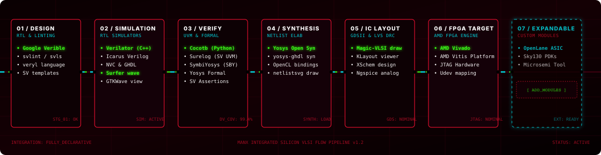

</div>

### Detailed Component Registry

| Pipeline Stage | Integrated Software Packages | Operational Objective |
| :--- | :--- | :--- |
| **01 / RTL & Lint** | `Google Verible`, `svlint`, `svls`, `veryl` | RTL static analysis, formatting standards, language servers, and modern design alternatives. |
| **02 / Simulation** | `Verilator` (C++), `Icarus Verilog`, `GHDL`, `NVC`, `Surfer`, `GTKWave` | Cycle-accurate simulation, parallel testing, digital wave trace analysis, and pulse rendering. |
| **03 / Verification** | `Cocotb` (Python), `Surelog` (SV UVM), `SymbiYosys` (SBY) | Co-simulation testbenches, formal verification assertions, and full UVM compilation. |
| **04 / Synthesis** | `Yosys` Open Synthesis, `yosys-ghdl` plugin | RTL elaboration, optimization, and mapping to target technology netlists. |
| **05 / IC Layout** | `Magic-VLSI`, `KLayout`, `XSchem`, `Ngspice` | Custom CMOS cell layouts, GDSII mask viewers, mixed-signal schematics, and SPICE simulations. |
| **06 / FPGA Target** | `AMD Vivado Suite`, `AMD Vitis Platform`, `JTAG udev` | Heterogeneous FPGA target synthesis, placing, routing, hardware programming, and debugging. |
| **07 / Expandable** | `OpenLane ASIC`, `Sky130 PDKs`, `Microsemi Tools` | Seamless extensibility support for custom ASIC toolchains, standard PDKs, and future hardware modules. |

---

## Workstation Management Console (`manx`)

The system operations workflow is completely centralized inside a high-fidelity control plane utility: `manx`. This script abstracts away low-level rebuild, garbage collection, and secret management commands into simple, standardized verbs.

```
  󱄅  M A N X   W O R K S T A T I O N  │    NIXOS SYSTEM
  ──────────────────────────────────────────────────────────────────────
    Host: MANX                 󰓅  Uptime: 2d 4h 12m
    Kernel: latest-cachyos       Status: Online
  ──────────────────────────────────────────────────────────────────────

  Usage: manx <command>

  󰓅  CONFIGURATION MANAGEMENT
    rebuild   ❯ Synchronize adjustments and show package changes
    update    ❯ Update system inputs and perform full build
    rollback  ❯ Revert to previous successful generation
    history   ❯ List detailed system generations

  󰌢  MAINTENANCE & SECURITY
    clean     ❯ Execute deep system maintenance protocols
    check     ❯ Validate configuration health and integrity
    bootstrap ❯ Setup Btrfs blank subvolumes & secrets keypaths
```

### Reference Table

| Verb | Under-the-hood Command Sequence | Engineering Safety Feature |
| :--- | :--- | :--- |
| `manx rebuild` | `nix fmt` ➔ Stages changes ➔ Runs Flake audit ➔ Evaluates NH switch ➔ `nvd` changes | **Security Shield**: Forcefully stages `variables.nix` / `secrets.yaml` so Nix can read them, but triggers a global reset trap to keep private keys unstaged immediately. |
| `manx check` | Stages files ➔ `nix flake check` ➔ Automated Reset | Validates that the Nix configuration compiles and option definitions are valid without executing a build. |
| `manx clean` | `nh clean all --keep 3` ➔ Garbage collects system/user store ➔ Hard-links duplicates | Reclaims storage blocks on your NVMe SSD. |
| `manx bootstrap` | Analyzes partition filesystem ➔ Secures `/persist` mappings ➔ Secures SOPS age directories | Automatically builds the pristine `/blank` Btrfs snapshots and decryption keypaths for single-step provisioning. |
| `manx vivado` | Distrobox engine initialization ➔ Icon mapping ➔ GUI entry | Enters the secure high-compatibility hardware design sandbox. |
| `manx edit` | fuzzy-finds `*.nix` and `*.yaml` ➔ launches Neovim | Accelerates config development via rapid module navigation. |

---

## 📂 Operating System Architecture

The repository layout follows a **DRY (Don't Repeat Yourself)** host-module hierarchy, separating generic hardware/software rules from host-specific disk configurations and network properties.

```bash
📁 nix-config/
├── ❄️ flake.nix                  # Unified entrypoint; pins external dependencies
├── 🖥️ hosts/
│   ├── 🌐 common/                # Shared module imports (boot, networks, locales)
│   ├── 🚀 manx/                  # Primary Workstation configuration
│   │   ├── 🔑 variables.nix      # Hardware properties, system UUIDs (Git-ignored)
│   │   └── 📄 variables.nix.example
│   └── 💻 laptop/                # Engineering Laptop configuration
├── 🧩 modules/
│   ├── 🏠 home/                  # Home Manager files (shell, Neovim, user-packages)
│   └── 🛡️ system/                # System packages (virtualization, Plymouth, scripts)
└── 🔒 secrets/
    ├── 🔑 secrets.yaml           # SOPS age-encrypted system passwords (Git-ignored)
    └── 📄 secrets.yaml.example
```

---

## Interface Gallery

<div align="center">
<table style="border-collapse: collapse; border: none; width: 100%;">
  <tr>
    <td width="50%" style="padding: 6px; border: none;">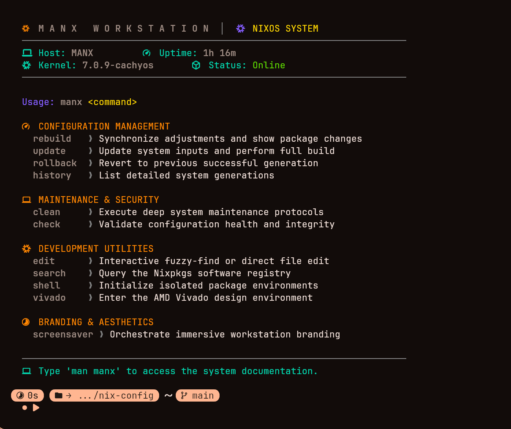<br/><sub><b>manx</b> — Primary control shell</sub></td>
    <td width="50%" style="padding: 6px; border: none;">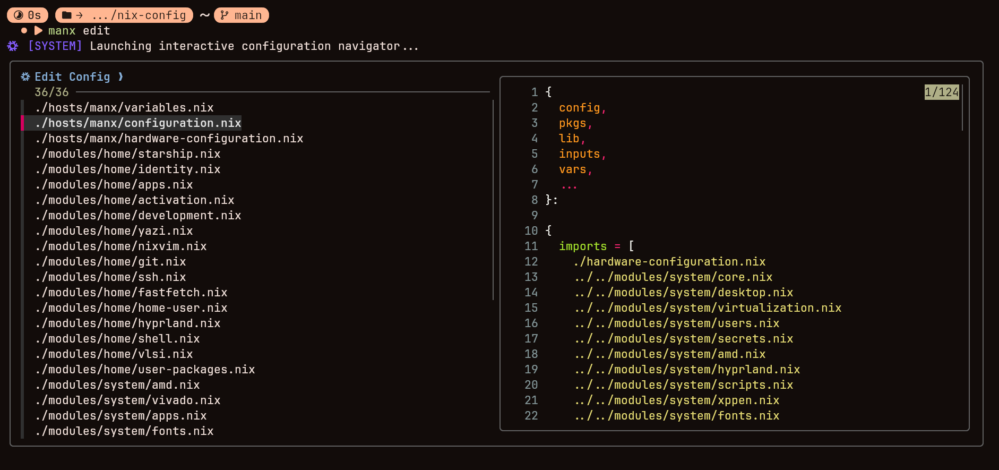<br/><sub><b>manx edit</b> — Configuration navigation</sub></td>
  </tr>
  <tr>
    <td width="50%" style="padding: 6px; border: none;">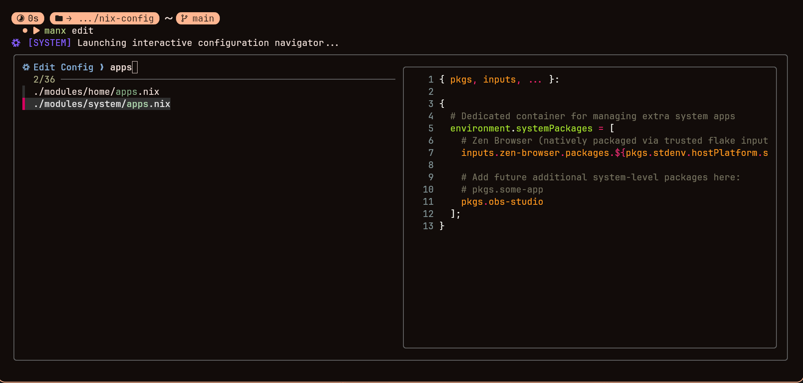<br/><sub>Live fuzzy preview while browsing modules</sub></td>
    <td width="50%" style="padding: 6px; border: none;">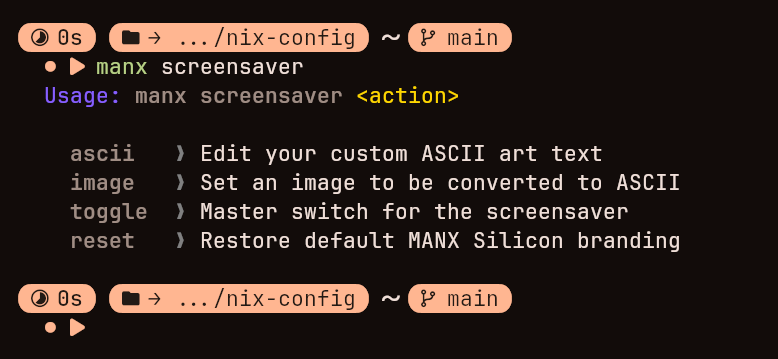<br/><sub>Branding screensaver orchestration panel</sub></td>
  </tr>
</table>
</div>

---

## 📦 Distrobox EDA Sandbox Guide (AMD Vivado & Vitis)

To run heavy, proprietary hardware design and verification frameworks like **AMD Xilinx Vivado & Vitis** without breaking NixOS's declarative and stateless nature, MANX OS deploys a high-compatibility high-performance container sandbox using **Distrobox** and **Podman/Docker**. 

This allows you to run Vivado with **native performance**, full hardware acceleration, Wayland screen rendering, and direct USB/JTAG device programming!

```mermaid
graph LR
    subgraph Host [❄️ Host: MANX OS]
        A[Desktop Launcher / CLI] -->|distrobox enter| B(🐧 manx-vivado Sandbox)
        C[🔌 Physical JTAG/FPGA USB] -->|Host Udev /dev/bus/usb| D(⚡ Interactive Programming)
    end
    subgraph Container [🐳 Arch/Ubuntu Sandbox]
        B -->|Wayland Socket Pass-through| E[🖥️ Vivado GUI / Waveforms]
        B -->|JTAG Hardware Bindings| D
    end
    style Host fill:#0d1117,stroke:#00f5ff,stroke-width:2px;
    style Container fill:#0d1117,stroke:#ff1133,stroke-width:2px;
```

<details>
<summary><b>🚀 1. Automated Provisioning & First Launch</b></summary>
<br/>

Setting up the EDA sandbox is extremely streamlined. Execute the following simple sequence to initialize your environment:

1. **Verify Podman/Docker Service**: Ensure virtualization is active:
   ```bash
   systemctl status podman --user
   ```
2. **Create the EDA Sandbox Container**:
   Initialize a high-compatibility environment (Ubuntu or Arch based) optimized for Vivado dependencies:
   ```bash
   distrobox-create --image archlinux:latest --name manx-vivado --home ~/.local/share/manx-vivado-home
   ```
3. **Install Core System Dependencies**:
   Enter the container and install X11/GL libraries required by Vivado's Java GUI:
   ```bash
   distrobox enter manx-vivado -- sudo pacman -Syu --noconfirm git base-devel libx11 libxft libxrender libxtst libxi libxrandr fontconfig freetype2 ncurses
   ```
</details>

<details>
<summary><b>⚡ 2. Installing AMD Vivado & Vitis</b></summary>
<br/>

1. **Download the Installer**: Obtain the Linux self-extracting installer (`.run` or `.bin`) for AMD Vivado/Vitis from the official site.
2. **Execute Installer inside Sandbox**:
   Move the installer to your shared home folder and launch it inside the container:
   ```bash
   distrobox enter manx-vivado -- ./FPGAs_Vivado_Unified_lnx.bin
   ```
3. **Installation Directory**: Ensure you install it directly under `/tools/Xilinx` (the standard enterprise path). The sandbox home is automatically mapped, maintaining file persistence across system reboots!
</details>

<details>
<summary><b>🔌 3. USB JTAG Hardware Bindings (FPGA Programming)</b></summary>
<br/>

To program physical hardware targets (like Basys 3, Nexys, or custom boards) directly from the Vivado GUI inside the container:

1. **Deploy Host Udev Rules**: Ensure the host has access to Digilent/Xilinx JTAG programmers. This is automatically handled by the system configuration in `modules/system/vivado.nix`!
2. **Load Cable Drivers inside Container**:
   Once Vivado is installed, register the Digilent cable drivers inside the Distrobox container:
   ```bash
   distrobox enter manx-vivado -- sudo /tools/Xilinx/Vivado/202X.X/data/xicom/cable_drivers/lin64/install_script/install_drivers/install_drivers
   ```
3. When you plug in your FPGA board via USB, Vivado will immediately recognize it on the JTAG chain!
</details>

<details>
<summary><b>🖥️ 4. GUI Tiling & Window Rules Safety</b></summary>
<br/>

- Vivado GUI is built on Java AWT, which has rendering issues in tiling window managers. The **MANX OS** wrapper automatically passes the key environment variable `_JAVA_AWT_WM_NONREPARENTING=1` to prevent gray screens.
- **Tiling Workaround**: Clicking settings, runs, or IP management generates secondary dialog windows. Hyprland is configured with S-Tier regex window rules that capture these popup frames and automatically floats and centers them cleanly on top of your main working workspace!
</details>

---

## Deployment & Setup Guide

### 1. Repository Setup
Clone the repository and copy the environment variables template for your specific host target:
```bash
git clone https://github.com/techanand8/nix-config.git ~/nix-config
cd ~/nix-config

# For the MANX Workstation:
cp hosts/manx/variables.nix.example hosts/manx/variables.nix

# For the Laptop:
cp hosts/laptop/variables.nix.example hosts/laptop/variables.nix
```

### 2. Configure Hardware Parameters
Generate the physical hardware configuration for your target drive layouts, mount paths, and CPU/GPU properties:
```bash
nixos-generate-config --show-hardware-config > hosts/manx/hardware-configuration.nix
```
Open `hosts/manx/variables.nix` in your text editor and adjust the settings:
- Update the `username` and default `timezone` / `locale`.
- Set the `enableImpermanence` flag to `true` (if running Btrfs stateless rollback) or `false`.
- Input the exact disk UUIDs and LUKS target paths.

### 3. Initialize and Apply Configuration
Deploy the system configurations:
```bash
# Using the custom utility:
manx rebuild

# Or using the standard Nix command:
sudo nixos-rebuild switch --flake .#MANX
```

---

## Binary Caching Setup (Cachix)

To prevent duplicate builds between the heavy primary workstation and the battery-saving laptop, setup a binary cache substituter:

1. **Establish Remote Cache**: Register a cache at [cachix.org](https://cachix.org).
2. **Authorize System**: Run `cachix authtoken <your-auth-token>` on the primary workstation.
3. **Configure Flake Variables**: Add your cache variables into `hosts/<host>/variables.nix`:
   ```nix
   cachixName = "your-cache-subdomain";
   cachixPublicKey = "your-cache-subdomain.cachix.org-1:your-public-key-here=";
   ```
On every successful `manx rebuild` run, the workstation will compile and automatically push new closures to the cache. The laptop will then fetch these pre-compiled closures, saving CPU and battery power!

---

<div align="center">
  
</div>

## ◈ Credits & Acknowledgments

The **MANX OS** environment is a culmination of exceptional open-source contributions. We extend our deepest gratitude to the following visionaries whose work forms the backbone of this workstation:

### Core Frameworks & Logic
*   **[Illogical Impulse](https://github.com/Illogical-Impulse)**: For the foundational keybindings, meticulous window rules.
*   **[Omarchy Linux](https://github.com/basecamp/omarchy)**: And the visionary screensaver logic I taken from here.
*   **[Ambxst Project](https://github.com/Axenide/Ambxst)**: For the sophisticated **Hyprland** shell framework and the aesthetic direction that defines the Ambxst experience.
*   **[ZaneyOS](https://github.com/Zaney/ZaneyOS)**: For the declarative structural inspiration and the clean organizational patterns that make this system mathematically reproducible.

### Engineering & Tooling
*   **The VLSI Community**: Our work is powered by the giants of open-source silicon design. Endless thanks to the maintainers of **Yosys**, **Verilator**, **Magic-VLSI**, and the **OpenLane** project. It is your commitment to open hardware that makes this workstation possible.

---

<div align="center">


<sub>Declarative by Design · Reproducible by Construction · Engineered for Silicon Engineering</sub>

</div>
