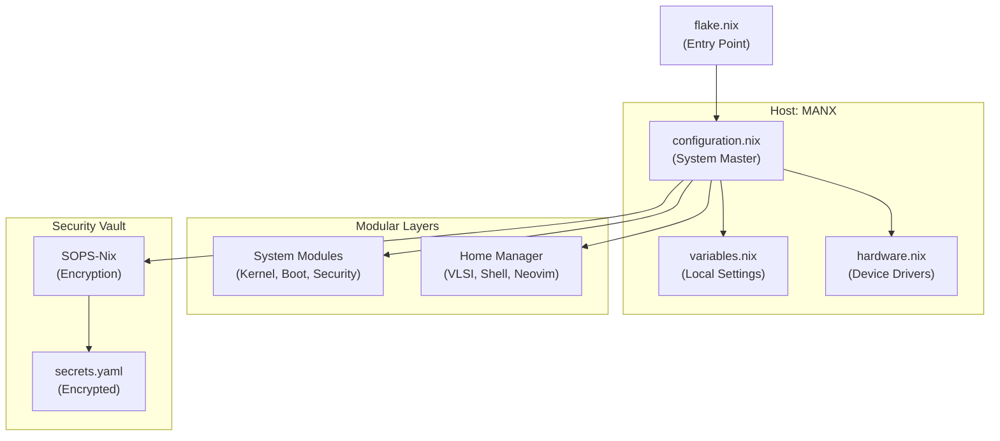

# 🛰️ MANX OS: Engineering-Grade Workstation
### A Declarative Ecosystem for VLSI, Deep Learning, and Hardware Design

<div align="center">

[](https://nixos.org)
[](https://github.com/CachyOS)
[](https://btrfs.readthedocs.io/en/latest/index.html)
[](https://hyprland.org)
[](https://github.com/nix-community/nixvim)

</div>

---

<div align="center">
  
  <br/>
  
  <details>
    <summary><b>🎬 VIEW HIGH-FIDELITY SDDM ANIMATION</b></summary>
    <br/>
    <video src="https://github.com/user-attachments/assets/550ed2ea-9580-4388-a82f-c8c525f316d5" width="100%" controls autoplay muted loop style="border-radius: 8px; border: 1px solid #333;"></video>
    <p><i>Live demonstration of the modular authentication interface with native Verilog syntax highlighting.</i></p>
  </details>
</div>

---

## 🔬 Core Mission
This workstation is a specialized NixOS distribution designed for **Microelectronics Engineers** and **Deep Learning Researchers**. It bridges the gap between the cutting-edge Linux ecosystem and the historically rigid world of proprietary EDA (Electronic Design Automation) tools.

The environment is built on **Stateless Btrfs Architecture**, meaning the system resets to a pristine state on every boot, ensuring absolute stability and preventing "configuration drift" over years of heavy engineering work.

---

## 🏗️ System Architecture & Reliability

<details>
  <summary><b>🛡️ STATELESS INTEGRITY (IMPERMANENCE)</b></summary>
  <br/>
  
  *   **Root Rollback:** The root partition (`/`) is wiped and restored from a blank Btrfs snapshot during the `initrd` phase of every boot.
  *   **Persistent State:** Only critical data (SSH keys, NetworkManager profiles, and the Nix Config) is preserved in `/persist` via bind-mounts.
  *   **Time-Machine Backups:** The `/home` directory is protected by **Snapper**, providing automated hourly snapshots for accidental data recovery.
</details>

<details>
  <summary><b>⚡ PERFORMANCE TUNING & GPU ACCELERATION</b></summary>
  <br/>

  *   **CachyOS Kernel:** Optimized for the `x86_64-v3` microarchitecture to maximize throughput in simulation and training workloads.
  *   **Latency Management:** Leverages the **sched-ext** framework with the `scx_lavd` scheduler for a zero-lag desktop experience even under 100% CPU load.
  *   **GPU Acceleration:** Integrated **ROCm** stack for AMD hardware, enabling native HIP and OpenCL support for Deep Learning frameworks and GPU-accelerated simulators.
</details>

---

## 🛠️ The Engineering Stack

<details>
  <summary><b>🟦 VLSI & DIGITAL VERIFICATION</b></summary>
  <br/>

  A production-grade toolchain for RTL design and functional verification:
  *   **Simulation:** `Verilator` (High-performance C++ cycle-accurate), `Icarus Verilog`, `NVC` (VHDL).
  *   **Formal Verification:** `SBY` (SymbiYosys) for bounded model checking.
  *   **Physical Design:** `Magic-VLSI` and `KLayout` for GDSII layout and DRC.
  *   **Python-Based DV:** Native `cocotb` integration for modern coroutine-based cosimulation.
</details>

<details>
  <summary><b>🧠 DEEP LEARNING & AI RESEARCH</b></summary>
  <br/>

  Optimized environment for high-intensity computation:
  *   **Frameworks:** Full support for `PyTorch` and `TensorFlow` via the ROCm/HIP backend.
  *   **Data Science:** Production-ready `NumPy`, `Pandas`, and `Matplotlib` pre-configured in the system shell.
  *   **Workflow:** Custom `nix-ld` configuration allows running unpatched pre-compiled binaries (like Conda environments or proprietary AI models) seamlessly.
</details>

<details>
  <summary><b>🚀 AMD VIVADO & VITIS (THE PRAGMATIC BRIDGE)</b></summary>
  <br/>

  This workstation solves the complex "Nix vs EDA" problem by utilizing a **Distrobox** container system.
  *   The **AMD Xilinx** suite runs inside an optimized Ubuntu container for 100% binary compatibility.
  *   **Native Integration:** Desktop launchers (Vivado GUI, Vitis IDE, DocNav) are mapped from the container to the host, making them feel like native NixOS applications.
  *   **Hardware Access:** Kernel-level `udev` rules enable rootless JTAG and hardware-in-the-loop debugging directly from the container.
</details>

---

## 🗺️ Project Structure

<div align="center">



</div>

---

## 🎮 System Orchestration (`manx` CLI)

The workstation includes a custom-built management utility, `manx`, designed for high-efficiency system maintenance and professional development workflows.

<details>
  <summary><b>🛠️ VIEW CLI COMMAND REFERENCE</b></summary>
  <br/>

| Category | Command | Function |
| :--- | :--- | :--- |
| **System** | `manx rebuild` | Atomic sync, code formatting, and detailed package diff reporting. |
| | `manx update` | Full input synchronization and system-wide refresh. |
| | `manx rollback` | Instant restoration of the previous successful system state. |
| | `manx history` | View the chronological audit log of all system generations. |
| **Maintenance** | `manx clean` | Deep 3-layer optimization: generation pruning, GC, and hard-linking. |
| | `manx check` | Comprehensive integrity audit of the flake configuration. |
| **Development** | `manx vivado` | Enters the high-compatibility Xilinx environment. |
| | `manx edit` | Interactive fuzzy-find (fzf) or direct file editing in Neovim. |
| | `manx shell <pkg>` | Initialize transient, isolated development environments. |
| **Aesthetics** | `manx screensaver` | Orchestrate custom ASCII/Image branding for the workstation. |

</details>

---

## 🖼️ Visual Showcase

<div align="center">
  <table style="border-collapse: collapse; border: none;">
    <tr>
      <td width="50%" align="center">
        
        <br/><i>The <b>manx</b> system orchestrator.</i>
      </td>
      <td width="50%" align="center">
        
        <br/><i>Branding & Screensaver control.</i>
      </td>
    </tr>
    <tr>
      <td width="50%" align="center">
        
        <br/><i>Fuzzy-find config navigation.</i>
      </td>
      <td width="50%" align="center">
        
        <br/><i>Instant preview & search.</i>
      </td>
    </tr>
  </table>
  <br/>
  
  <details>
    <summary><b>✨ VIEW SILICON SCREENSAVER PREVIEW</b></summary>
    <br/>
    
    <p><i>Immersive terminal text effects for workstation branding.</i></p>
  </details>
</div>

---

## 🚀 Installation & Deployment

<details>
  <summary><b>📦 STEP 1: INITIALIZE CONFIGURATION</b></summary>
  <br/>

  On any NixOS system (or the installer), run:
  ```bash
  git clone https://github.com/techanand8/nix-config.git ~/nix-config
  cd ~/nix-config

  # Create your local variables file
  cp hosts/manx/variables.nix.example hosts/manx/variables.nix
  # Edit variables.nix with your username, email, and preferred versions.
  ```
</details>

<details>
  <summary><b>🔧 STEP 2: HARDWARE ADAPTATION</b></summary>
  <br/>

  If you are not using the exact same hardware as this profile, you **must** update the hardware configuration:
  1.  Generate a configuration for your current machine:
      ```bash
      nixos-generate-config --show-hardware-config > hosts/manx/hardware-configuration.nix
      ```
  2.  Open `hosts/manx/hardware-configuration.nix` and ensure it uses your actual partitions (e.g., `ext4`, `fat32`, etc.).
</details>

<details>
  <summary><b>⚡ STEP 3: CHOOSE DEPLOYMENT MODEL</b></summary>
  <br/>

  #### Path A: Standard Installation (Easy)
  If you want a normal, persistent system:
  1.  Open `hosts/manx/configuration.nix`.
  2.  **Comment out or remove** the line: `./modules/system/stateless.nix`.
  3.  Apply the system:
      ```bash
      sudo nixos-rebuild switch --flake .#MANX
      ```

  #### Path B: Professional Stateless Setup (Advanced)
  This requires the "Total Erasure" model using Btrfs snapshots.
  1.  **Requirement:** Your `hardware-configuration.nix` must use Btrfs and include a subvolume named `root` and a snapshot named `blank`.
  2.  Ensure `stateless.nix` is enabled in your imports.
  3.  Follow the [Disk Preparation Guide](#-disk-preparation-manual-steps) below.
</details>

---

<div align="center">
  <sub>Designed for precision engineering by <b>Mayank Anand</b></sub><br/>
  <sub>Fully Declarative • Repositories are mathematically reproducible</sub>
</div>
