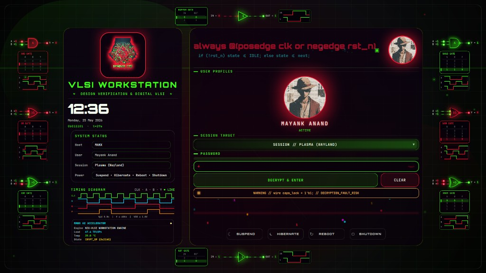
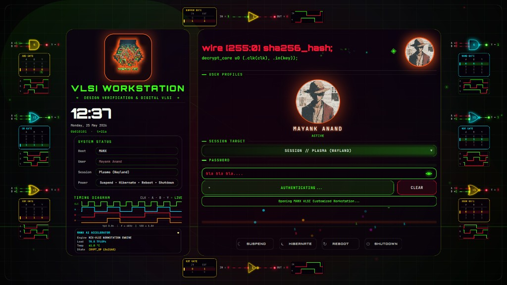
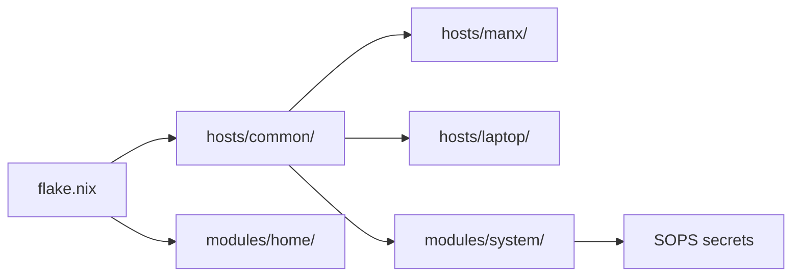

<div align="center">


<br/>


<br/>

[](https://nixos.org)
[](https://github.com/CachyOS)
[](https://btrfs.readthedocs.io)
[](https://hyprland.org)
[](https://github.com/nix-community/nixvim)

</div>

---

## Authentication Interface

The SDDM theme is built as a **VLSI workstation console** — not a generic login screen. Logic gates, live timing diagrams, system telemetry, and HDL-style copy turn authentication into part of the engineering workflow.

<table>
  <tr>
    <td width="50%" align="center">
      
      <br/>
      <sub><b>Hardware-aware input</b> — Caps Lock surfaces as a Verilog-style fault line:<br/><code>wire caps_lock = 1'b1; // DECRYPTION_FAULT_RISK</code></sub>
    </td>
    <td width="50%" align="center">
      
      <br/>
      <sub><b>Session handoff</b> — Live auth progress while the workstation initializes your environment.</sub>
    </td>
  </tr>
</table>

<div align="center">

<video src="https://github.com/user-attachments/assets/e10cb4ce-a8f8-454e-965a-573eb7a385e7" width="100%" controls autoplay muted loop />

<sub>Full interface walkthrough — logic framing, telemetry panels, and session flow.</sub>

</div>

---

## What This Is

**MANX OS** is a production NixOS configuration for hardware engineers. It delivers:

- **Reproducible builds** — Flake-locked inputs, modular hosts, SOPS-encrypted secrets.
- **EDA without polluting the host** — Vivado/Vitis in Distrobox with JTAG `udev` pass-through and native Hyprland windows.
- **Optional impermanence** — Btrfs root rollback on boot; state lives on `/persist` and Snapper-protected `/home`.
- **One command operations** — `manx` handles rebuild, rollback, Vivado, dev shells, and Cachix sync.

Built for RTL design, verification, formal methods, and architectural exploration — not a desktop rice config with tools bolted on.

---

## Daily Operations

Everything runs through **`manx`**. No scattered scripts, no manual `nixos-rebuild` flags to remember.

| Command | Purpose |
| :--- | :--- |
| `manx rebuild` | Validate flake, switch generation, diff packages, push to Cachix |
| `manx edit` | Fuzzy-find and open any module in the tree |
| `manx rollback` | Revert to the previous working generation |
| `manx history` | Inspect generation timeline |
| `manx clean` | Garbage-collect old store paths |
| `manx vivado` | Enter the AMD toolchain container |
| `manx shell <pkg>` | Ephemeral environment without global installs |

<details>
<summary><b>Configuration workflow</b></summary>

1. Edit modules under `hosts/` or `modules/`.
2. Run `manx rebuild` — flake check runs before apply.
3. Review the `nvd` diff for package changes.
4. Git commit is recorded automatically (secrets stay unstaged).

</details>

---

## Engineering Stack

<div align="center">

[](#)
[](#)
[](#)

</div>

<details>
<summary><b>Complete toolchain (20+ tools)</b></summary>

| Category | Tools |
| :--- | :--- |
| **Verification** | Cocotb, Surelog, SymbiYosys (SBY), Verible, SVLint |
| **Simulation** | Verilator, Icarus, NVC, GHDL |
| **Architecture** | Spike, QEMU, RISC-V pk |
| **Cross-compile** | RISC-V GCC, ARM embedded GCC |
| **Physical design** | Magic-VLSI, KLayout, NetlistSVG |
| **Schematic / analog** | XSchem, Ngspice |
| **Waveforms** | GTKWave, Surfer, WaveDrom |

Proprietary AMD tools run inside **`manx-vivado`** (Ubuntu container) with desktop entries and icon sync from the installed toolchain.

</details>

---

## Architecture



| Layer | Role |
| :--- | :--- |
| `flake.nix` | Inputs, `mkSystem`, Home Manager, dev shell |
| `hosts/common/` | Shared boot, modules, locale — DRY across machines |
| `hosts/<host>/variables.nix` | Private settings (git-ignored); `.example` fallback for `flake check` |
| `modules/system/` | Kernel, Hyprland, impermanence, VPN, AI, Vivado udev |
| `modules/home/` | Nixvim, VLSI packages, shell, Hyprland Lua |

<details>
<summary><b>Impermanence (optional)</b></summary>

Set `enableImpermanence = true` in `variables.nix`. On boot, the root subvolume resets from a `blank` Btrfs snapshot; `/persist` bind-mounts preserve NetworkManager, SSH, SOPS state, `/tools`, and your home directory.

</details>

<details>
<summary><b>Performance profile</b></summary>

- **CachyOS kernel** — `x86_64-v3` tuned for simulation throughput
- **sched-ext** — `scx_lavd` keeps the desktop responsive under full CPU load
- **ROCm** — AMD GPU compute for ML and accelerated workloads
- **Cachix** — Workstation pushes builds; laptop pulls pre-built closures

</details>

---

## Interface Gallery

<div align="center">
<table>
  <tr>
    <td width="50%"><br/><sub><b>manx</b> — system control plane</sub></td>
    <td width="50%"><br/><sub><b>manx edit</b> — config navigation</sub></td>
  </tr>
  <tr>
    <td width="50%"><br/><sub>Live preview while browsing modules</sub></td>
    <td width="50%"><br/><sub>Terminal branding orchestration</sub></td>
  </tr>
</table>
</div>

---

## Deployment

```bash
git clone https://github.com/techanand8/nix-config.git ~/nix-config
cd ~/nix-config
cp hosts/manx/variables.nix.example hosts/manx/variables.nix
# Edit variables.nix — hostname, disks, LUKS UUIDs, feature flags
```

**Hardware config:**

```bash
nixos-generate-config --show-hardware-config > hosts/manx/hardware-configuration.nix
```

**Apply:**

```bash
manx rebuild
# or: sudo nixos-rebuild switch --flake .#MANX
```

| Mode | Setting |
| :--- | :--- |
| **Standard (persistent root)** | `enableImpermanence = false` in `variables.nix` |
| **Stateless root** | `enableImpermanence = true` — requires Btrfs `root` + `blank` subvolumes |

**Laptop:** Copy `hosts/laptop/variables.nix.example`, generate `hardware-configuration.nix`, deploy with `.#LAPTOP`.

---

## Cachix (multi-machine builds)

1. Create a cache at [cachix.org](https://cachix.org).
2. On the workstation: `cachix authtoken <token>`.
3. In each host's `variables.nix`:

```nix
cachixName = "your-cache";
cachixPublicKey = "your-cache.cachix.org-1:...";
```

`manx rebuild` pushes the new generation automatically. Other machines pull binaries on the next rebuild — no rebuild farm on a laptop.

---

<div align="center">


<sub>Declarative by design · Reproducible by construction · Engineered for silicon work</sub>

</div>
