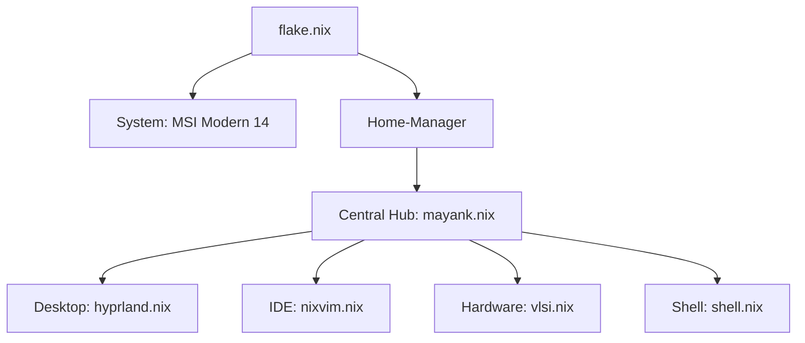

# NixOS Engineering Workstation
## Hardware Design and Digital Verification Environment

---

**A comprehensive, modular NixOS configuration optimized for professional VLSI development, including RTL design, functional verification, and physical implementation.**

[Architecture](#-system-architecture) • [Toolchain](#-vlsi-toolset) • [Development Environment](#-integrated-development-environment) • [Management](#-system-management)

---

## 🏗️ System Architecture

This repository implements a modular Nix architecture based on the "Master Hub" pattern. The configuration is decoupled into functional units to ensure scalability, reproducibility, and maintainability.

---

## 🛠️ VLSI Toolset

The environment provides a pre-configured suite of industry-standard and open-source tools for the full IC design cycle.

| Domain | Integrated Utilities |
| :--- | :--- |
| **Logic Simulation** | Icarus Verilog, Verilator, GHDL |
| **Waveform Analysis** | GTKWave, Surfer |
| **Synthesis & PnR** | Yosys, Magic VLSI |
| **Physical Design** | KLayout (GDSII/OASIS Support) |
| **Circuit Simulation** | Ngspice |

---

## 📟 Integrated Development Environment

The development environment is powered by a custom **Nixvim** implementation, providing an IDE-like experience for hardware description languages.

*   **Language Server Protocol (LSP)**: Real-time linting and analysis via `Verible` (SystemVerilog), `VHDL-LS`, and `Clangd` (SystemC/C++).
*   **Hierarchical Outlining**: Structural navigation of complex RTL modules through `Aerial.nvim`.
*   **Media Previews**: Native rendering of technical documentation and schematics directly within the editor.
*   **Formatting**: Automated code standardization via the `Conform` framework.

---

## 🎨 Interface & Ergonomics

*   **Compositor**: Modular Hyprland configuration utilizing pure Lua for desktop management.
*   **Theming**: Dynamic synchronization of terminal emulators (Kitty, Ghostty) and system prompts with the global aesthetic.
*   **Authentication**: Hardened security policies with automated keyring management and secure credential handling.

---

## ⚡ System Management

Operational tasks are streamlined through a custom CLI utility:

| Command | Function |
| :--- | :--- |
| `mayank rebuild` | Formats source, records version history, applies configuration, and synchronizes to remote. |
| `mayank update` | Updates flake inputs and synchronizes system dependencies. |
| `mayank clean` | Executes garbage collection and storage optimization. |

---

## 📜 Acknowledgments

This configuration incorporates and extends logic from the following projects:
*   [Ambxst](https://github.com/Axenide/Ambxst) for UI components.
*   [Illogical Impulse](https://github.com/end-4/dots-hyprland) for modular architecture insights.

---

  Developed by <b>Mayank Anand</b>

