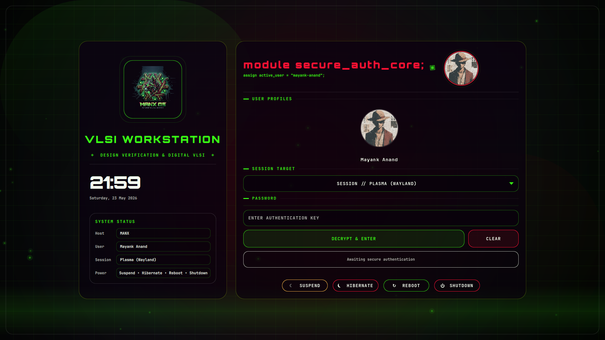
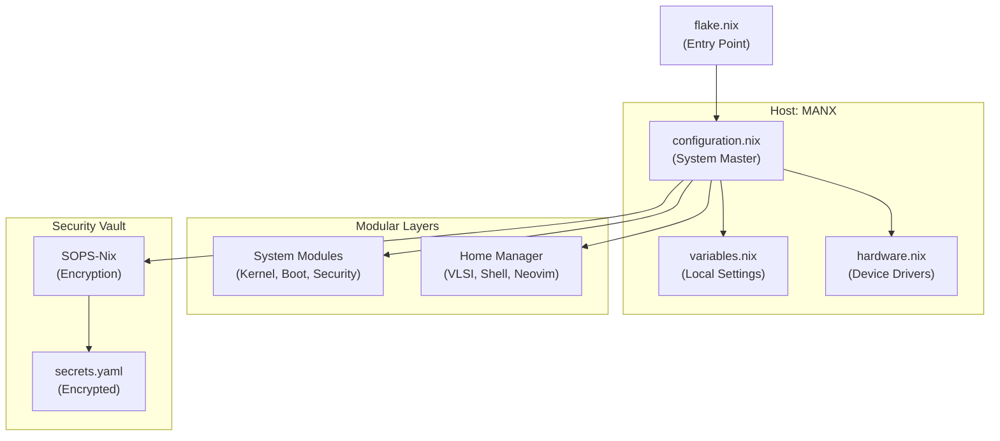

# 🛰️ MANX OS: Engineering Workstation
### Declarative Environment for VLSI, Hardware Design, and Deep Learning

<div align="center">

[](https://nixos.org)
[](https://github.com/CachyOS)
[](https://btrfs.readthedocs.io/en/latest/index.html)
[](https://hyprland.org)
[](https://github.com/nix-community/nixvim)

</div>

---

> **MANX OS** is a specialized, mathematically reproducible NixOS configuration. It bridges the stability of a stateless Linux foundation with the complex dependency requirements of proprietary Electronic Design Automation (EDA) and machine learning toolchains.

<div align="center">
  
  <br/><br/>
  
  <details>
    <summary><b>🎬 VIEW AUTHENTICATION INTERFACE ANIMATION</b></summary>
    <br/>
    <video src="https://github.com/user-attachments/assets/550ed2ea-9580-4388-a82f-c8c525f316d5" width="100%" controls autoplay muted loop style="border-radius: 8px; border: 1px solid #444;"></video>
    <p><i>Demonstration of the modular authentication interface featuring native Verilog syntax highlighting.</i></p>
  </details>
</div>

---

## ⚙️ Operational Workflow

The system is designed to minimize configuration drift. All daily operations, environment management, and system updates are handled through the unified `manx` orchestration tool.

<details>
  <summary><b>1. System Configuration & Maintenance</b></summary>
  <br/>
  
  To modify the system, edit the respective Nix files and apply the changes atomically:
  *   **Edit Configuration:** Run `manx edit` to open the configuration tree in an interactive fuzzy-finder.
  *   **Apply Changes:** Run `manx rebuild` to compile and switch to the new system generation.
  *   **Audit History:** Run `manx history` to view the chronological log of all applied system generations.
  *   **Garbage Collection:** Run `manx clean` to clear old system generations and free up disk space.
</details>

<details>
  <summary><b>2. Hardware Design & EDA Toolchain</b></summary>
  <br/>

  Proprietary tools (like AMD Vivado/Vitis) often require rigid, legacy Linux environments (e.g., Ubuntu 22.04). MANX OS isolates these using containerization while maintaining deep host integration:
  *   **Launch Environment:** Run `manx vivado` to seamlessly enter the hardware-accelerated Ubuntu container.
  *   **Native Integration:** GUI applications launched from the container export their windows natively to the Hyprland Wayland compositor.
  *   **Hardware Access:** JTAG programmers and FPGAs connected to the host are automatically passed through to the container via precise `udev` rules.
</details>

<details>
  <summary><b>3. Transient Development Shells</b></summary>
  <br/>

  To maintain system purity, isolated shells are used for specific project requirements rather than installing packages globally.
  *   **Quick Shell:** Run `manx shell <package_name>` to instantly access a tool without permanently modifying the system environment.
</details>

---

## 🛠️ Engineering Stack & Verification Suite

This workstation provides a specialized, production-grade environment for RTL design, hardware verification, and architectural exploration.

<div align="center">

### 🧪 Primary Design & Verification Toolset
  
  [](#)
  [](#)
  [](#)

<br/>

<details>
  <summary><b>🔍 VIEW COMPLETE ENGINEERING TOOLCHAIN (20+ TOOLS)</b></summary>
  <br/>

| Category | Tool | Description |
| :--- | :--- | :--- |
| **Verification (DV)** | `Cocotb` | Coroutine-based cosimulation framework for modern SV/VHDL verification. |
| | `Surelog` | Comprehensive SystemVerilog compiler and parser with full UVM support. |
| | `SBY` | Front-end for Yosys-based formal verification (SymbiYosys). |
| | `Verible` | SystemVerilog developer tools, including linter and formatter. |
| **Simulation** | `Verilator` | High-performance, cycle-accurate C++ Verilog simulator. |
| | `Icarus Verilog` | Standard-compliant Verilog simulation and synthesis tool. |
| | `NVC` | Optimized VHDL compiler and simulator. |
| | `GHDL` | Open-source analyzer, compiler, and simulator for VHDL. |
| **Architectural** | `Spike` | The official RISC-V ISA simulator for architectural golden-model verification. |
| | `QEMU` | Universal system emulator and user-mode binary executor. |
| | `Proxy Kernel (pk)` | Lightweight execution environment for RISC-V ISA simulators. |
| **Compilers** | `RISC-V GCC` | 64-bit embedded cross-compiler for RISC-V targets. |
| | `ARM GCC` | Professional embedded toolchain (`arm-none-eabi`) for Cortex-A/M. |
| **Physical Design** | `Magic-VLSI` | Industry-standard VLSI layout tool and DRC engine. |
| | `KLayout` | Advanced GDSII/OASIS viewer and editor with Python scripting. |
| | `NetlistSVG` | Visualizes digital logic netlists as clean SVG diagrams. |
| **Schematic** | `XSchem` | High-performance schematic capture for VLSI and mixed-signal design. |
| | `Ngspice` | General-purpose circuit simulator for analog and mixed-signal verification. |
| **Analysis** | `GTKWave` | Fully-featured wave viewer for digital simulation results. |
| | `Surfer` | Modern, high-performance waveform visualizer for large datasets. |
| | `WaveDrom` | Renders digital timing diagrams from high-level descriptions. |

</details>
</div>

---

## 🏗️ Architecture & Reliability

<details>
  <summary><b>🛡️ STATELESS INTEGRITY (IMPERMANENCE)</b></summary>
  <br/>
  
  *   **Root Rollback:** The root partition (`/`) is wiped and restored from a blank Btrfs snapshot during the `initrd` phase of every boot.
  *   **Persistent State:** Only critical data (SSH keys, NetworkManager profiles, and the Nix Config) is preserved in `/persist` via bind-mounts.
  *   **Time-Machine Backups:** The `/home` directory is protected by **Snapper**, providing automated hourly snapshots for disaster recovery.
</details>

<details>
  <summary><b>⚡ PERFORMANCE TUNING & GPU ACCELERATION</b></summary>
  <br/>

  *   **Kernel Optimization:** Utilizes the CachyOS Kernel tuned for the `x86_64-v3` microarchitecture to maximize throughput in simulation and training workloads.
  *   **Latency Management:** Leverages the **sched-ext** framework with the `scx_lavd` scheduler to maintain desktop responsiveness under 100% CPU load.
  *   **Compute Acceleration:** Integrated **ROCm** stack for AMD hardware, enabling native HIP and OpenCL support for machine learning frameworks and GPU-accelerated simulators.
</details>

---

## 🗺️ System Topology

<div align="center">



</div>

---

## 🖼️ Interface & Operations

<div align="center">
  <table style="border-collapse: collapse; border: none;">
    <tr>
      <td width="50%" align="center">
        
        <br/><i>System orchestration via the <b>manx</b> CLI.</i>
      </td>
      <td width="50%" align="center">
        
        <br/><i>Idle state and terminal aesthetics configuration.</i>
      </td>
    </tr>
    <tr>
      <td width="50%" align="center">
        
        <br/><i>Fuzzy-finding through the configuration tree.</i>
      </td>
      <td width="50%" align="center">
        
        <br/><i>Real-time file preview during navigation.</i>
      </td>
    </tr>
  </table>
  <br/>
  
  <details>
    <summary><b>✨ Preview</b></summary>
    <br/>
    <div align="center">
      
      <p><i>Screensaver image.</i></p>
      <hr style="border: 0.5px solid #222;">
    </div>
  </details>
</div>

---

## 🚀 Deployment Instructions

<details>
  <summary><b>📦 STEP 1: INITIALIZE REPOSITORY</b></summary>
  <br/>

  Execute the following on a NixOS live installer or existing system:
  ```bash
  git clone https://github.com/techanand8/nix-config.git ~/nix-config
  cd ~/nix-config

  # Copy the variables template
  cp hosts/manx/variables.nix.example hosts/manx/variables.nix
  
  # Edit variables.nix with your local credentials and preferences.
  ```
</details>

<details>
  <summary><b>🔧 STEP 2: HARDWARE ADAPTATION</b></summary>
  <br/>

  Generate the specific hardware profile for your target machine:
  1.  Generate the configuration:
      ```bash
      nixos-generate-config --show-hardware-config > hosts/manx/hardware-configuration.nix
      ```
  2.  Verify `hosts/manx/hardware-configuration.nix` matches your actual disk layout and partition types (e.g., `ext4`, `fat32`, `btrfs`).
</details>

<details>
  <summary><b>⚡ STEP 3: EXECUTE DEPLOYMENT</b></summary>
  <br/>

  #### Option A: Standard Persistent Installation (Recommended)
  Standard setup retaining system state across reboots.
  1.  Open `hosts/manx/configuration.nix`.
  2.  **Remove or comment out** the import for `./modules/system/stateless.nix`.
  3.  Apply the configuration:
      ```bash
      sudo nixos-rebuild switch --flake .#MANX
      ```

  #### Option B: Stateless Installation (Advanced)
  Implements the "Total Erasure" model requiring specific Btrfs subvolumes.
  1.  **Prerequisite:** Your partition scheme must utilize Btrfs with a subvolume named `root` and a read-only snapshot named `blank`.
  2.  Ensure `./modules/system/stateless.nix` remains enabled in `configuration.nix`.
  3.  Proceed with deployment:
      ```bash
      sudo nixos-rebuild switch --flake .#MANX
      ```
</details>

---

<div align="center">
  <sub>Designed for precision engineering by <b>Mayank Anand</b></sub><br/>
  <sub>Fully Declarative Architecture • Mathematically Reproducible</sub>
</div>
