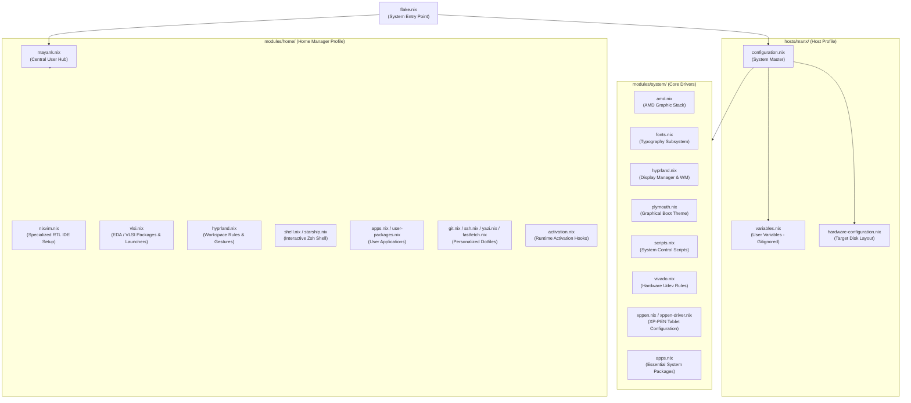

<div align="center">

# 🌌 High-Performance Engineering Workstation
### Declarative Microelectronics & Functional Hardware Verification Environment

[](https://nixos.org)
[](https://github.com/CachyOS)
[](https://hyprland.org)
[](https://github.com/nix-community/nixvim)
[](LICENSE)

---

**A mathematically reproducible, modular NixOS workstation deployment configured for advanced digital design, functional verification (DV), custom silicon physical layouts, and streamlined interactive computing.**

[Host Identity & Optimizations](#-host-identity--optimizations) • [System Architecture](#-system-architecture) • [VLSI & Verification Stack](#-vlsi--verification-stack) • [Binary Compatibility](#-fhs-interoperability--binary-compatibility) • [IDE Architecture](#-integrated-development-environment) • [Workspace Controls](#-system-management) • [Credits](#-acknowledgments--credits)

---

</div>

## 💻 Host Identity & Optimizations (`MANX`)

At the core of this workstation is the custom host configuration **`MANX`**. Tailored specifically for modern AMD architecture and highly intensive silicon modeling workloads, it bridges extreme system responsiveness with strict declarative stability.

### Key Workstation Capabilities:
*   **CachyOS Kernel Optimization:** Runs the highly optimized **CachyOS Linux Kernel** (`linuxPackages-cachyos-latest-x86_64-v3`) utilizing `-v3` microarchitecture instructions, yielding improved memory throughput and execution speeds.
*   **Next-Gen Task Scheduling:** Leverages the **sched-ext** user-space scheduling framework with the `scx_lavd` (Latency-Aware Virtual Desktop) scheduler, providing unmatched interactive smoothness even under heavy multi-threaded VLSI compilations.
*   **Fluid Boot Sequence:** Employs the **Limine Bootloader** styled with a bespoke translucent deep ruby glassmorphic menu card, glowing electric red borders, neon green standard terminals, and a custom **Plymouth boot animation** powered by early-graphical SimpleDRM handover.
*   **System Integrity & Resiliency:** Automated monthly **Btrfs filesystem scrubbing** to prevent bit-rot, rapid `zram` compressed swap allocation for dynamic memory expansion, and CPU performance governing configured via `power-profiles-daemon`.
*   **Security & Hardening:** Robust underlying LUKS encryption, secure automated Gnome Keyring hooks, pre-integrated VPN configurations (OpenConnect, OpenFortiVPN, WireGuard), and graphic writing tablet integrations via specialized XP-PEN kernel drivers.

---

## 🏗️ System Architecture

This repository adopts a strictly decoupled, modular configuration layout. By isolating system-wide resources, user preferences, and hardware properties, the workstation guarantees absolute reproducibility and clean maintenance boundaries.



---

## 🔬 VLSI & Verification Stack

This workstation provisions a production-grade, pre-configured collection of academic and industry-standard Electronic Design Automation (EDA) applications. The packages are organized to support advanced Hardware Description Languages (HDLs), Hardware Verification Languages (HVLs), and formal proof frameworks.

### Core Toolchain Matrix

| Design & Verification Domain | Tech Utilities | Supported Standards & Methodologies |
| :--- | :--- | :--- |
| **Universal Verification** | `surelog` | **UVM (Universal Verification Methodology)**, SystemVerilog (IEEE 1800) |
| **Logic Simulation** | `verilator`, `iverilog`, `nvc`, `ghdl` | Highly-optimized C++ RTL compilation, Verilog (IEEE 1364), VHDL (IEEE 1076) |
| **Formal Analysis** | `sby` (SymbiYosys), `yosys` | Bounded Model Checking (BMC), Temporal Logic Assertions, RTL Equivalence |
| **Waveform Visualization** | `surfer`, `gtkwave` | High-throughput FST, VCD, and GHW hardware execution trace analysis |
| **Physical Implementation** | `magic-vlsi`, `klayout` | Custom GDSII / OASIS layout design, DRC (Design Rule Checking) |
| **Schematic & Netlisting** | `xschem`, `netlistsvg` | Hierarchical SPICE/Verilog capture, vector schematic generation |
| **Analog Simulation** | `ngspice` | SPICE engine mixed-level & mixed-signal simulation |
| **Code Diagnostic & LSP** | `svls`, `svlint`, `verible` | SystemVerilog Language Server Protocol, strict standard-compliance linters |
| **Hardware Modeling** | `veryl` | Modern logic-design dialect transpiling directly to SystemVerilog |
| **Documentation & Timing** | `python3Packages.wavedrom` | Declarative JSON-to-SVG digital timing diagram rendering |

> [!NOTE]
> **A Passionately Curious Approach to Hardware Engineering:**
> This configuration represents a personal, evolving journey into the deep and fascinating world of silicon design. Driven by genuine curiosity and a passion for microelectronics, this ecosystem is actively maintained and expanded. As my knowledge in functional verification, advanced architectures, and physical design continues to grow, I am committed to exploring and configuring new EDA tools, synthesis frameworks, and design methodologies to keep this system at the absolute cutting edge.

### Integrated AMD Xilinx Vivado & Vitis Environment

To support hardware syntheses and target FPGA development, the configuration implements isolated desktop launchers running the **AMD Vivado & Vitis 2025.2 Design Suite** inside an optimized **Distrobox container** (`mayank-vivado`). This setup keeps the root Nix store completely pristine while giving the applications full acceleration and access to system devices:

*   **AMD Vivado (GUI & Terminal):** Standard standalone graphical launch and integrated Tcl shell environments running inside Ghostty, Kitty, or xterm.
*   **AMD Vitis Unified IDE:** Integrated software platforms for heterogeneous system designs (GUI & CLI environments).
*   **Support Utilities:** Interactive Documentation Navigator (`DocNav`), Xilinx Information Center (`XIC`), and safe integrated uninstall mechanisms.

---

## 🛡️ FHS Interoperability & Binary Compatibility

To bridge the gap between NixOS’s isolated store topology and legacy commercial microelectronics CAD tools, the workstation implements a seamless dual-layer compatibility layer:

```
  Unpatched Commercial Binary / Legacy Shell Script
                        │
                        ├──► [Envfs FUSE Layer] ────────► Resolves /bin/bash & shebang paths dynamically
                        │
                        └──► [Nix-LD Dynamic Shim] ─────► Injects NIX_LD_LIBRARY_PATH (glibc, X11, GTK3)
```

1.  **Envfs shebang Virtualization (`services.envfs.enable = true`):** Dynamically intercepts and virtualizes hardcoded directory paths in scripts (such as `#!/bin/bash`, `#!/usr/bin/env python`, or `#!/bin/sh`), pointing them transparently to correct active Nix store paths without requiring manual patching.
2.  **Nix-LD Dynamic Library Injection (`programs.nix-ld`):** Intercepts standard Linux ELF dynamic linkers, injecting a custom loader path populated with critical graphics, system, font, and desktop libraries (including `glibc`, `zlib`, X11, OpenGL, GTK3, and ALSA). This allows proprietary binaries to execute exactly as they would on traditional FHS-compliant systems.

---

## 📟 Integrated Development Environment

Hardware development is anchored by a highly customized, responsive **Nixvim** configurations. The editor is optimized specifically for writing error-free hardware descriptions and system verifications.

*   **Real-time Semantic Analysis:** Language server protocols configured for `Verible` (SystemVerilog), `VHDL-LS` (VHDL), and `Clangd` (SystemC/C++).
*   **Structural Outlines:** In-depth tree-based code exploration using `Aerial.nvim` to track hierarchical RTL and UVM structures.
*   **Unified Formatting:** Standardized coding styling applied automatically on save via the `Conform` framework (utilizing `verible-verilog-format`).
*   **Interactive Utilities:** File explorers managed through `yazi`, rapid terminal toggles, and customized aesthetic extensions.

---

## ⚡ System Management

Rebuilding, updating, and optimizing the system is driven by a custom developer CLI utility:

| Command | Rationale & Pipeline |
| :--- | :--- |
| `mayank rebuild` | Validates configuration syntax, captures configuration states into Git, triggers system transaction, and synchronizes revisions. |
| `mayank update` | Evaluates system lockfiles, updates flake inputs, and fetches downstream packages. |
| `mayank clean` | Initiates deep store optimization, garbage-collects unused system generations, and recovers storage. |

---

## 💖 Acknowledgments & Credits

This workstation setup thrives on the collaborative genius of the open-source community. Special gratitude is extended to:

*   **[ambxst](https://github.com/ambxst):** Whose incredible, modular dotfiles and NixOS architectural structure served as the foundational blueprint for this entire configuration.
*   **[illogical-impulse](https://github.com/end4):** For the breathtaking desktop gestural mechanics, window rules, and aesthetic configurations that make the Hyprland environment an absolute joy to use daily.

---

<div align="center">
  <sub>Driven by Passionate Curiosity • Configured Declaratively</sub>
</div>
