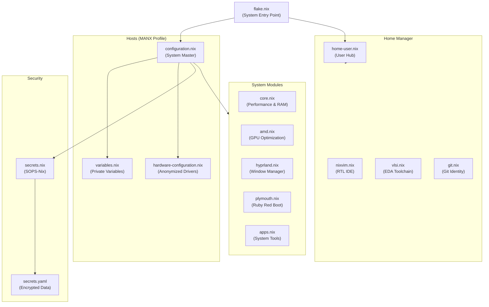

<div align="center">

# 🌌 High-Performance Engineering Workstation
### Fully Declarative & Reproducible Microelectronics Environment

[](https://nixos.org)
[](https://github.com/CachyOS)
[](https://btrfs.readthedocs.io/en/latest/index.html)
[](https://hyprland.org)
[](https://github.com/nix-community/nixvim)

---

**A 100% declarative, mathematically reproducible NixOS workstation. This configuration is engineered for high-performance VLSI design and verification, utilizing industry-standard tooling alongside cutting-edge Linux optimizations.**

[Host Identity](#-host-identity--optimizations) • [Storage Architecture](#-storage-architecture) • [System Architecture](#-system-architecture) • [VLSI & Verification Stack](#-vlsi--verification-stack) • [Installation Guide](#-deployment--installation)

---

</div>

## 💻 Host Identity & Optimizations (`MANX`)

The **`MANX`** workstation is a specialized host profile optimized for modern AMD architectures and high-intensity silicon modeling workloads.

### Performance Stack:
*   **CachyOS Kernel:** Runs the optimized **CachyOS Kernel** (`linuxPackages-cachyos-latest-x86_64-v3`) with `-v3` microarchitecture optimizations for superior throughput.
*   **Latency-Aware Scheduling:** Leverages the **sched-ext** framework with the `scx_lavd` scheduler for unmatched interactive smoothness.
*   **Limine Bootloader:** A high-speed, modern graphical bootloader with custom styling and a translucent ruby-red glassmorphic interface.
*   **Storage Efficiency:** Native **Btrfs** with `zstd` compression, `zram` swap allocation, and automated maintenance protocols to prevent bit-rot.

---

### 💾 Storage Architecture

This workstation utilizes a manual but highly optimized hardware configuration, ensuring maximum stability and performance across different drive layouts.

#### 🛡️ Full-Disk Encryption & Partitioning
The storage configuration is manually mapped in `hosts/manx/hardware-configuration.nix` and implements a professional-grade security model:
*   **LUKS2 Encryption:** Native full-disk encryption for both the root system and the dedicated swap partition, utilizing `allowDiscards` for SSD longevity.
*   **TPM2 Hardware Security:** This workstation is **TPM2 Ready**. It leverages the onboard Trusted Platform Module to securely and automatically unlock the LUKS partitions during boot. This provides a "Zero-Touch" decryption experience—maintaining high security while removing the friction of manual password entry at every startup.
*   **Btrfs Subvolume Topology:** A sophisticated layout for better isolation and snapshot management:
    *   `/` (Root System)
    *   `/home` (User Data)
    *   `/nix` (Nix Store)
    *   `/srv` (Service Data)
    *   `/var/lib/portables` & `/var/lib/machines` (Systemd Containers)
    *   `/var/tmp` (Persistent temporary storage for heavy builds)
*   **RAM-Based Temp Storage:** `/tmp` is mounted as a **tmpfs** (RAM) to minimize SSD wear and maximize speed for small temporary files.
*   **SSD Optimization:** Uses `discard=async` and `zstd:3` compression for high-performance operations—ideal for modern NVMe drives.

---

## 🏗️ System Architecture

This repository adopts a decoupled, modular layout to isolate system drivers, user preferences, and hardware properties.



---

## 🔬 VLSI & Verification Stack

Provisioned with a production-grade Electronic Design Automation (EDA) toolchain for RTL design, functional verification (DV), and physical layout.

| Domain | Tools | Standards |
| :--- | :--- | :--- |
| **Verification** | `surelog`, `verilator` | UVM, SystemVerilog |
| **Simulation** | `iverilog`, `ghdl`, `nvc` | Verilog, VHDL |
| **Formal Analysis** | `sby`, `yosys` | Bounded Model Checking |
| **Physical Design** | `magic-vlsi`, `klayout` | GDSII Layout, DRC |
| **Schematic** | `xschem`, `ngspice` | SPICE Simulation |

### 🚀 AMD Vivado Integration (Distrobox)
This workstation solves the complex dependency issues of EDA tools by running the **AMD Vivado & Vitis Design Suite** entirely within an optimized **Distrobox** container (`manx-vivado`). This provides full hardware acceleration and X11/Wayland GUI support while keeping the NixOS host pristine.

#### Setting up Vivado:
1. **Initialize the Container:**
   Simply run the custom workstation command:
   ```bash
   manx vivado
   ```
   *If the container doesn't exist, this automatically creates an Ubuntu 22.04 environment named `manx-vivado` and mounts your home directory.*

2. **Install the Tools (Inside the container):**
   * Download the Xilinx Unified Installer (e.g., 2025.2) to your host machine.
   * Inside the `manx vivado` shell, navigate to the installer and run it:
     ```bash
     cd ~/Downloads/Xilinx_Unified_*
     sudo ./xsetup
     ```
   * **Important:** Install the tools to `/tools/Xilinx` (the default path expected by the NixOS launchers).

3. **Seamless Desktop Integration:**
   * Desktop shortcuts for Vivado (GUI/Tcl), Vitis, and DocNav are automatically generated by `modules/home/vlsi.nix`.
   * These shortcuts seamlessly execute the tools from the container directly onto your Hyprland desktop.

---

## 🛡️ Compatibility Layer
*   **Envfs (`services.envfs.enable = true`):** Dynamically resolves hardcoded paths (e.g., `#!/bin/bash`) to correct Nix store paths.
*   **Nix-LD (`programs.nix-ld`):** Injects required libraries into unpatched commercial binaries, allowing legacy CAD tools to run seamlessly on NixOS.

---

## 🚀 Deployment & Installation

### 1. Initialize the Flake
```bash
git clone https://github.com/techanand8/nix-config.git ~/nix-config
cd ~/nix-config
```

### 2. Configure Variables
Initialize your local variables (this file is gitignored to protect your privacy):
```bash
cp hosts/manx/variables.nix.example hosts/manx/variables.nix
# Edit variables.nix with your username, email, and preferences
```

### 3. Generate Hardware Config
If installing on new hardware, generate the base configuration:
```bash
nixos-generate-config --show-hardware-config > hosts/manx/hardware-configuration.nix
# Manually adjust UUIDs and mount options for Btrfs/LUKS as needed
```

### 4. Apply System
```bash
sudo nixos-rebuild switch --flake .#MANX
```

---

## 🛠️ Customization & Hardware Adaptation

While this configuration is optimized for the `MANX` workstation, it is designed for extensibility. If you are adapting this for your own system, follow these steps:

### 1. Identify Your Hardware
Update `hosts/manx/variables.nix` with your specific parameters:
*   **CPU/GPU Type:** Set `cpuType` and `gpuType` (e.g., `amd`, `intel`, `nvidia`).
*   **Main Disk:** Identify your target drive using `lsblk`.

### 2. Tailor System Modules
The repository uses modular driver sets. In `hosts/manx/configuration.nix`:
*   **AMD Users:** Keep `../../modules/system/amd.nix` and the `nixos-hardware` AMD modules in `flake.nix`.
*   **NVIDIA Users:** Replace the AMD module with a dedicated NVIDIA module (e.g., `../../modules/system/nvidia.nix`) and ensure `hardware.nvidia` settings match your card generation.
*   **Intel Users:** Adjust the `nixos-hardware` imports in `flake.nix` to `common-cpu-intel` and `common-gpu-intel`.

### 3. Stability Note (For New Deployments)
If you experience a black screen during the *initial* activation on high-performance schedulers:
*   This configuration includes `systemd.services.scx.restartIfChanged = false;` which prevents the kernel from swapping schedulers while the desktop is active.
*   **Recommendation:** Perform your first rebuild from a TTY (Ctrl+Alt+F3) or reboot immediately after the first rebuild to ensure the new scheduler state is cleanly loaded.

---

| Command | Operational Workflow |
| :--- | :--- |
| `manx rebuild` | Atomic system rebuild with **NH**, **NOM**, and visual delta reports. |
| `manx update` | Synchronizes all flake inputs and performs a full system refresh. |
| `manx clean` | Deep maintenance: garbage collection and store optimization. |
| `manx check` | Integrity audit of the entire flake configuration. |

---

<div align="center">
  <sub>Designed & Maintained by **Mayank Anand** • Driven by Passionate Curiosity • Fully Declarative</sub>
</div>
